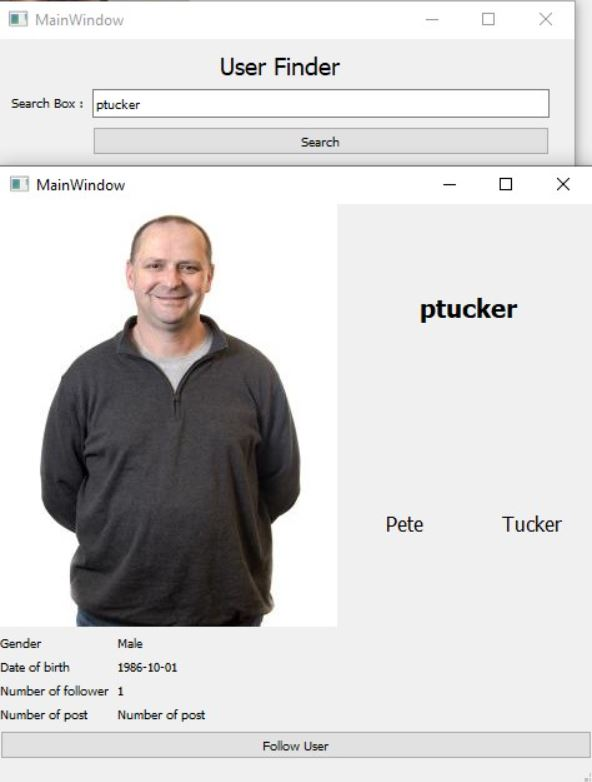
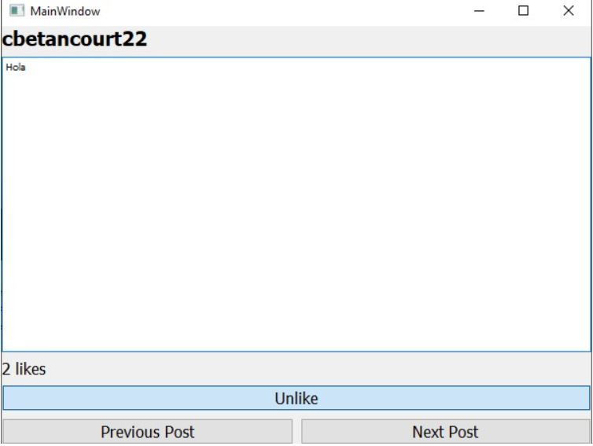
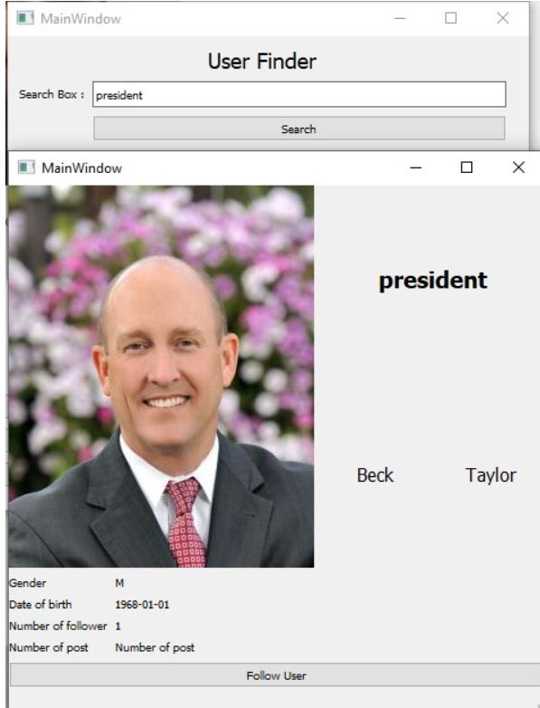

# WhitBook
CS374 - Intro to databasemanagement - Final project  Group member: Phuc Cai, Bishesh Tuladhar, Xavier Betancourt, Nhatminh Nguyen.
!Note: Original repo is found in Whitworth's own Git platform 'Whitgit'. This is a copy of the work done for presentation purposes.

## Authors
Cai, Phuc; Betancourt, Xavier, Tuladhar, Bishes; Nguyen, Nhatminh. Whitworth University CS

## Project Details
Detail description about the project can be found at: [./Documentation/ProjectDetails.docx] (/Documentation/ProjectDetails.docx)

## How to Compile the Program
The program can be started by running ./main.py

## Login and Register
After starting the program, the user can choose to either login or register a new user 

## Register
New users can register by giving some information like username, firstname, lastname, and password. If user registered using a Whitworth University user name, the program will automatically pull the user's profile image from Whitworth's site. 

## Create Post
After loging in, users can see their own personal information and options to create new post, view other user posts and make new posts
By clicking create post, there will be a window where users can input the content of their new post and post it. 

## Search and Follow Users
User can also search for other user, view their information and follow them by selecting option **Search User** 

## View Other Users' Posts
After following other people, user can see and like other people post by selecting the option 'View Post Feed'
In this windows, the user can choose to like or unlike a post, see the number of like and the content as well as the author, and scroll to other post using the option of next and previous post. 

## Special Feature
By registering to this application with Whitworth username, the application will automatically download their Whitworth profile picture and use it.
An example here is Whitworth username of our president Beck Taylor.  

