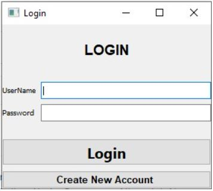
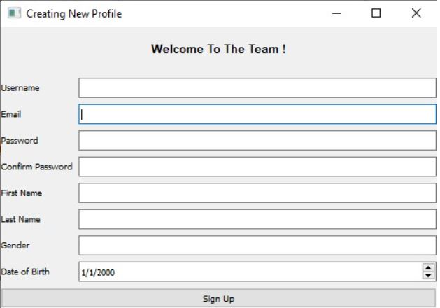

# WhitBook
CS374 - Intro to databasemanagement - Final project  Group member: Phuc Cai, Bishesh Tuladhar, Xavier Betancourt, Nhatminh Nguyen

## Authors
Cai, Phuc; Betancourt, Xavier, Tuladhar, Bishes; Nguyen, Nhatminh. Whitworth University CS

## Project Details
Detail description about the project can be found at: [./Documentation/ProjectDetails.docx] (/Documentation/ProjectDetails.docx)

## How to Compile the Program
The program can be started by running ./main.py

## Login and Register
After starting the program, the user can choose to either login or register a new user 

## Register
New users can register by giving some information like username, firstname, lastname, and password. If user registered using a Whitworth University user name, the program will automatically pull the user's profile image from Whitworth's site. 

## Create Post
After loging in, users can see their own personal information and options to create new post, view other user posts and make new posts
By clicking create post, there will be a window where users can input the content of their new post and post it. 

